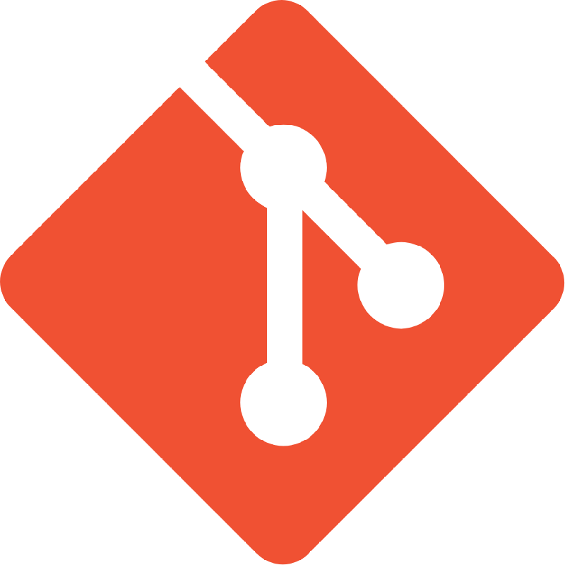
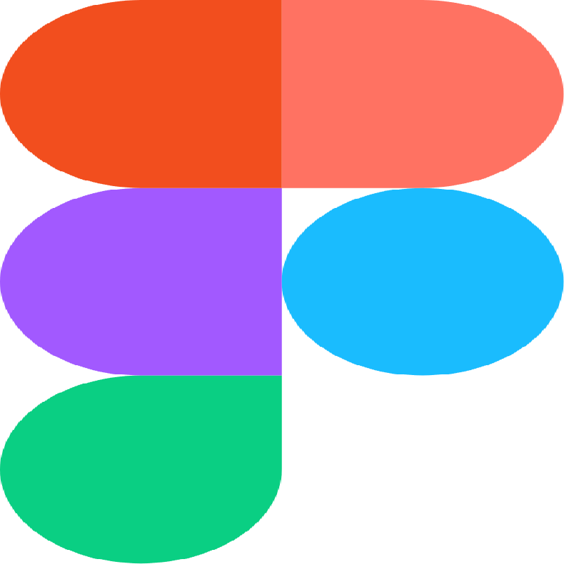
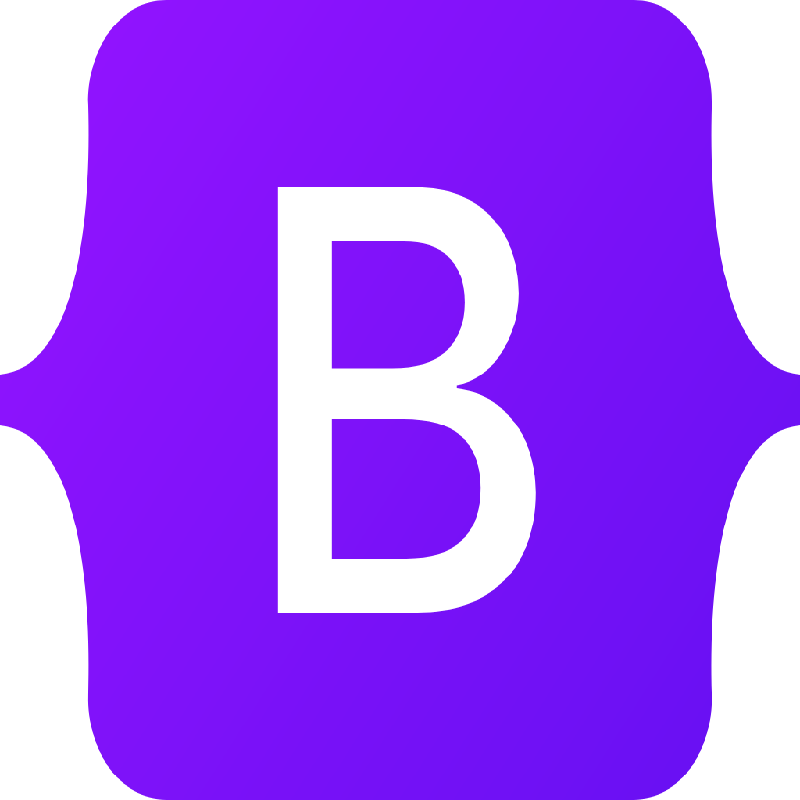

<h1 align="center">Hi there👋, I'm Subir Kumar🧑🏾‍💻</h1>

I am a self taught <b>Web Developer</b> form India. 

 
[a relative link](other_file.md)

    &nbsp;&nbsp;
    &nbsp;&nbsp;
    &nbsp;&nbsp;
    &nbsp;&nbsp;

* * *

<h2>🪧I'm currently working with...</h1>

 

<u style="text-underline-offset:3px;">**Language Knowledge :--**</u>

&nbsp;&nbsp;
&nbsp;&nbsp;

<u style="text-underline-offset:3px;">**Tools Knowledge :--**</u>

&nbsp;&nbsp;
&nbsp;&nbsp;
&nbsp;&nbsp;
&nbsp;&nbsp;
&nbsp;&nbsp;
&nbsp;&nbsp;

 

***

<h2>🌱 I'm currently learning...</h1> 

&nbsp;&nbsp;&nbsp;&nbsp;&nbsp;&nbsp;&nbsp;&nbsp;&nbsp;&nbsp;&nbsp;&nbsp;&nbsp;&nbsp;&nbsp;&nbsp;&nbsp;&nbsp;&nbsp;&nbsp;&nbsp;&nbsp;

